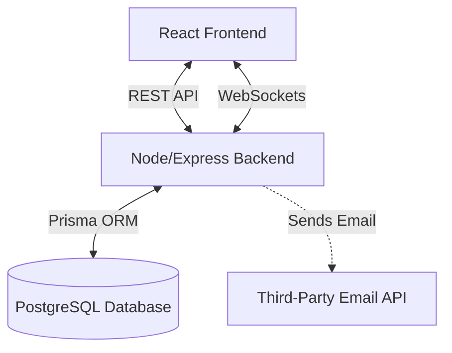

# Task2Do

Task2Do is a complete Agile project management web application. It allows users to create projects, manage issues, organize sprints and backlog items, work on a Scrum/Kanban board, and collaborate with team members in real-time.

## Features

- **Workspaces & Projects**: Secure role-based access for workspaces. Create and manage multiple projects within a workspace.
- **Issue Management**: Create and track issues with custom numbering, priority, story points, and assignees.
- **Scrum/Kanban Board**: Drag-and-drop board with columns based on issue status.
- **Sprints & Backlog**: Plan sprints, track velocity, and prioritize the product backlog.
- **Real-Time Collaboration**: Real-time board updates, `@mentions`, comments, and in-app notifications.

## Tech Stack (Planned)

- **Frontend**: React (Vite) + TypeScript
- **Backend**: Node.js + Express.js
- **Database**: PostgreSQL (Prisma ORM)
- **Real-time**: Socket.io

## Architecture Diagram

